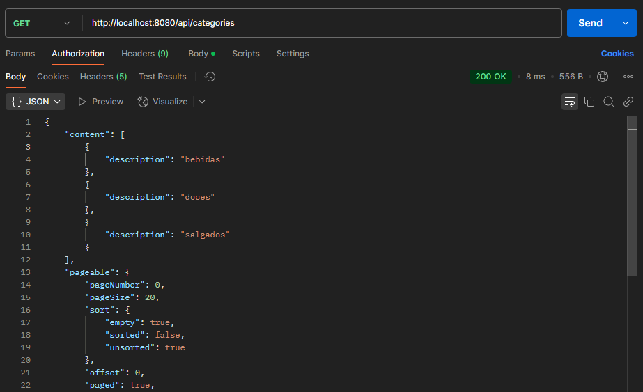
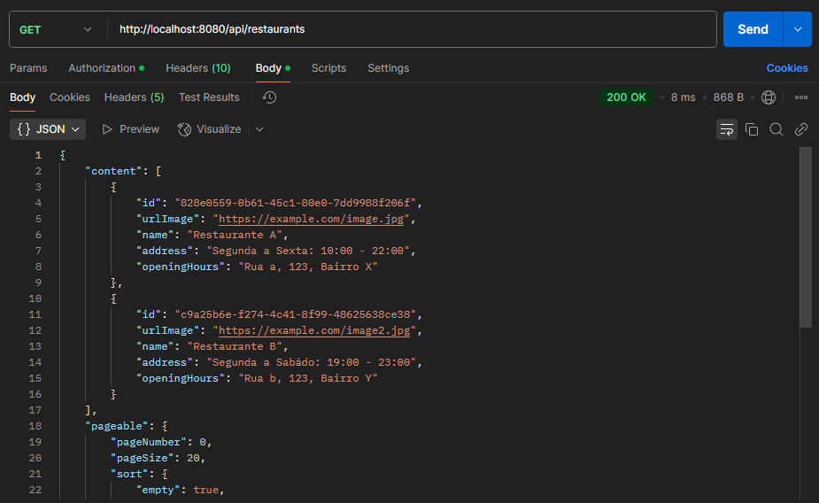
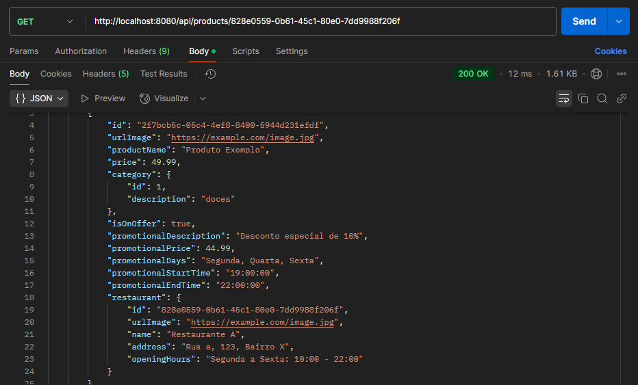

  
  <h1>Desafio Backend: Goomer Lista Rango 🍔</h1>

O desafio, encontrado no GitHub da Goomer, consistiu na criação de uma API de Restaurantes, que permite listar, cadastrar, alterar e atualizar restaurantes e seus produtos associados. Durante o desenvolvimento, tive a oportunidade de aplicar conceitos e ferramentas que já conhecia do ecossistema Spring. Explorei a implementação de **Interface Specification**, permitindo consultas dinâmicas e personalizadas ao banco de dados, além de realizar testes unitários com **JUnit** e **Mockito**.

    
<b>Categorias</b>

    

    
<b>Restaurantes</b>

    

    
<b>Produtos</b>

    

## 💻 Funcionalidades e Tecnologias
- **Pageable** – Paginação eficiente de resultados.
- **Specifications** – Consultas dinâmicas e filtradas para produtos e restaurantes.
- **Testes Unitários** – Garantia de qualidade com JUnit e Mockito.
- **Tratamento de Exceções** – Respostas personalizadas para erros.
- **Documentação** – Documentação completa dos endpoints com Swagger.
- **DTOs** – Conversão eficiente de entidades para DTOs.
- **Validação de Dados** – Validação através de anotações personalizadas com **jakarta.validation**.
  
## 📝 Sobre 

- **Nome do Projeto:** Goomer Lista Rango
- **Link do Desafio:** [goomer-challenge](https://github.com/goomerdev/job-dev-backend-interview)
- **Objetivo do Projeto:** Criar uma API RESTful capaz de gerenciar os restaurantes e os produtos do seu cardápio.
- **Tecnologias que utilizei:** Java, Spring Boot e MySQL.

### Instruções do desafio

- Listar todos os restaurantes
- Cadastrar novos restaurantes
- Listar os dados de um restaurante
- Alterar os dados um restaurante
- Excluir um restaurante
- Listar todos os produtos de um restautante
- Criar um produto de um restaurante
- Alterar um produto de um restaurante
- Excluir um produto de um restaurante

#### Restaurante

- O cadastro do restaurante precisa ter os seguintes campos:
  - Foto do restaurante
  - Nome do restaurante
  - Endereço do restaurante
  - Horários de funcionamento do restaurante (ex.: De Segunda à Sexta das 09h as 18h e de Sabado à Domingo das 11h as 20h).

#### Produtos

- O cadastro de produtos do restaurante precisa ter os seguintes campos:
  - Foto do produto
  - Nome do produto
  - Preço do produto
  - Categoria do produto (ex.: Doce, Salgados, Sucos...)
  - Quando o Produto for colocado em promoção, precisa ter os seguintes campos:
    - Descrição para a promoção do produto (ex.: Chopp pela metade do preço)
    - Preço promocional
    - Dias da semana e o horário em que o produto deve estar em promoção
   
## ⚙️ Como executar

Pré-requisito: Java 21 e MySQL

1. Clone o repositório
2. Instale as dependências do pom.xml com Maven
3. Crie o database no MySQL com as configurações do application.properties
4. Execute o GoomerApplication
5. Testar endpoints através do Postman ou da url <http://localhost:8080/swagger-ui/index.html>

